- [进入点播管理系统的网址](#%E8%BF%9B%E5%85%A5%E7%82%B9%E6%92%AD%E7%AE%A1%E7%90%86%E7%B3%BB%E7%BB%9F%E7%9A%84%E7%BD%91%E5%9D%80)
- [视频点播应用管理](#%E8%A7%86%E9%A2%91%E7%82%B9%E6%92%AD%E5%BA%94%E7%94%A8%E7%AE%A1%E7%90%86)
  * [视频列表](#%E8%A7%86%E9%A2%91%E5%88%97%E8%A1%A8)
  * [视频地区](#%E8%A7%86%E9%A2%91%E5%9C%B0%E5%8C%BA)
  * [视频导入](#%E8%A7%86%E9%A2%91%E5%AF%BC%E5%85%A5)
  * [视频分类管理](#%E8%A7%86%E9%A2%91%E5%88%86%E7%B1%BB%E7%AE%A1%E7%90%86)
  * [视频上传路径管理](#%E8%A7%86%E9%A2%91%E4%B8%8A%E4%BC%A0%E8%B7%AF%E5%BE%84%E7%AE%A1%E7%90%86)
  * [批量上传管理](#%E6%89%B9%E9%87%8F%E4%B8%8A%E4%BC%A0%E7%AE%A1%E7%90%86)
- [视频录制应用管理](#%E8%A7%86%E9%A2%91%E5%BD%95%E5%88%B6%E5%BA%94%E7%94%A8%E7%AE%A1%E7%90%86)
  * [节目管理](#%E8%8A%82%E7%9B%AE%E7%AE%A1%E7%90%86)
  * [频道管理](#%E9%A2%91%E9%81%93%E7%AE%A1%E7%90%86)
- [常见点播视频管理操作说明](#%E5%B8%B8%E8%A7%81%E7%82%B9%E6%92%AD%E8%A7%86%E9%A2%91%E7%AE%A1%E7%90%86%E6%93%8D%E4%BD%9C%E8%AF%B4%E6%98%8E)
  * [添加一个单独的点播节目](#%E6%B7%BB%E5%8A%A0%E4%B8%80%E4%B8%AA%E5%8D%95%E7%8B%AC%E7%9A%84%E7%82%B9%E6%92%AD%E8%8A%82%E7%9B%AE)
  * [添加一个视频集合（电视剧）](#%E6%B7%BB%E5%8A%A0%E4%B8%80%E4%B8%AA%E8%A7%86%E9%A2%91%E9%9B%86%E5%90%88%E7%94%B5%E8%A7%86%E5%89%A7)
  * [创建一个分类](#%E5%88%9B%E5%BB%BA%E4%B8%80%E4%B8%AA%E5%88%86%E7%B1%BB)
  * [批量上传视频文件和封面图片文件](#%E6%89%B9%E9%87%8F%E4%B8%8A%E4%BC%A0%E8%A7%86%E9%A2%91%E6%96%87%E4%BB%B6%E5%92%8C%E5%B0%81%E9%9D%A2%E5%9B%BE%E7%89%87%E6%96%87%E4%BB%B6)
  * [对视频列表进行批量操作](#%E5%AF%B9%E8%A7%86%E9%A2%91%E5%88%97%E8%A1%A8%E8%BF%9B%E8%A1%8C%E6%89%B9%E9%87%8F%E6%93%8D%E4%BD%9C)
  * [点播节目数据备份及恢复](#%E7%82%B9%E6%92%AD%E8%8A%82%E7%9B%AE%E6%95%B0%E6%8D%AE%E5%A4%87%E4%BB%BD%E5%8F%8A%E6%81%A2%E5%A4%8D)
  * [录播节目转点播](#%E5%BD%95%E6%92%AD%E8%8A%82%E7%9B%AE%E8%BD%AC%E7%82%B9%E6%92%AD)

# 进入点播管理系统的网址

网址为`http://<ip>/admin`

有两种方式进入点播管理系统网页：
* 在`http://<ip>/vod/index.html`中，点击右上角的`系统管理`按钮
* 直接输入网址`http://<ip>/admin`

# 视频点播应用管理

如下图所示，红色框部分为所有视频点播应用部分的功能，点击`增加`可以直接进入添加页面，点击`修改`会进入列表页面，下面先大概介绍一下每个部分所代表的功能含义，然后再介绍常见管理员操作具体步骤。

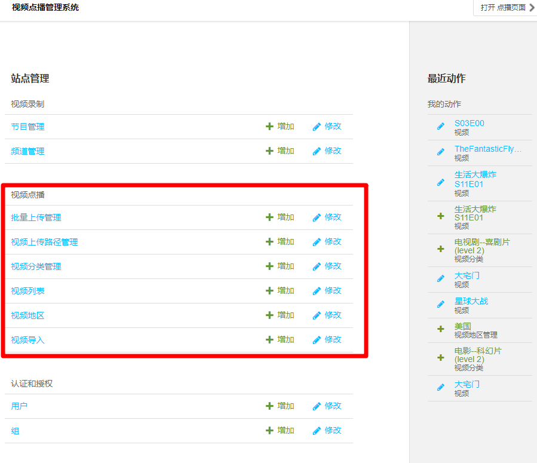

## 视频列表

视频列表包含所有的点播节目的创建、修改、删除、查询功能，所有点播播放页面中显示的点播节目都来源于此。

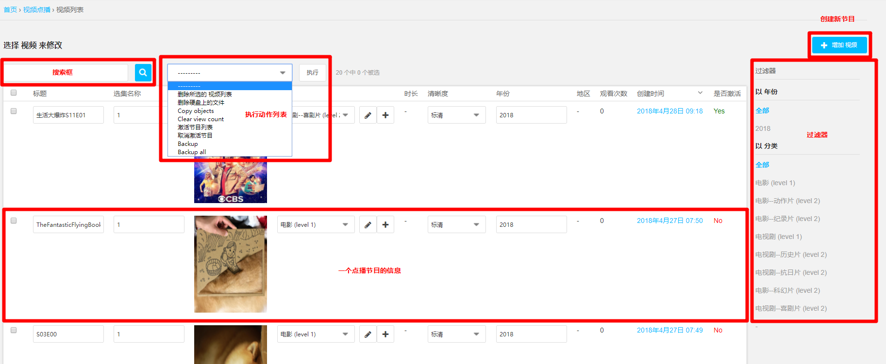

进入视频列表界面后，如上图所示，图中红框标识了一些主要的组成部分：

- 搜索框

  > 键入关键字，搜索点播节目

- 执行动作列表

  > 选中需要进行批量操作的点播节目的最左端的复选框，然后选择想要进行的操作，然后点击执行。点播系统正式上线后可进行的批量操作有：激活节目、取消激活节目、删除视频及文件、备份节目、备份所有节目。

- 一个点播节目信息

  > 没个点播节目都占有一行用于展示节目信息，包括标题、选集名称、图片、分类、时长、清晰度、年份、地区、观看次数、修改时间、是否激活，这些字段都属于该节目。这里只是在点播视频列表中快速展示这些信息，以及某些信息的快速修改，如果要对该节目的信息进行详细编辑，需要点击图片或者蓝色的链接进入详细信息编辑页面。

- 点播节目过滤器

  > 提供快捷的视频过滤器功能，可以按照年份、分类进行视频列表过滤

- 创建节目按钮

  > 如果要添加一个点播节目，点击此按钮进入点播视频添加页面。

## 视频地区

视频地区包含信息比较简单，列表中只显示该视频地区的名称

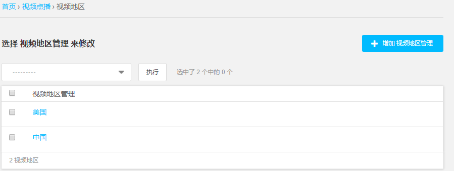

## 视频导入

这里提供点播节目数据导入功能，在点击`增加视频导入`按钮后，进入视频导入页面，在`备份配置文件`处上传备份配置文件，然后点击`保存`即可完成备份配置文件的导入。

> 这里的备份配置文件是由`视频列表`页面中，动作列表里的备份操作生成的json格式的文本文件。

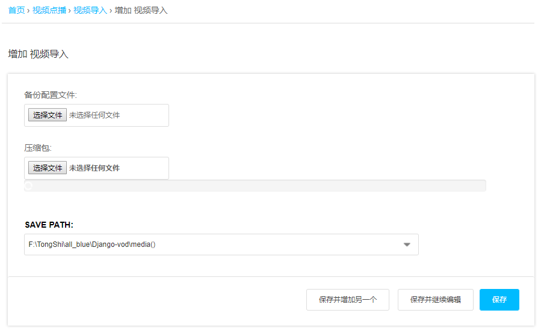

## 视频分类管理

这里用于管理所有的视频分类信息，视频分类规定一共有两级分类：

- 一级分类：视频分类的大分类，比如电影、电视剧、综艺等。
- 二级分类：某个一级分类下的小分类，比如电影下面可以包括动作片、科幻片、历史片等。

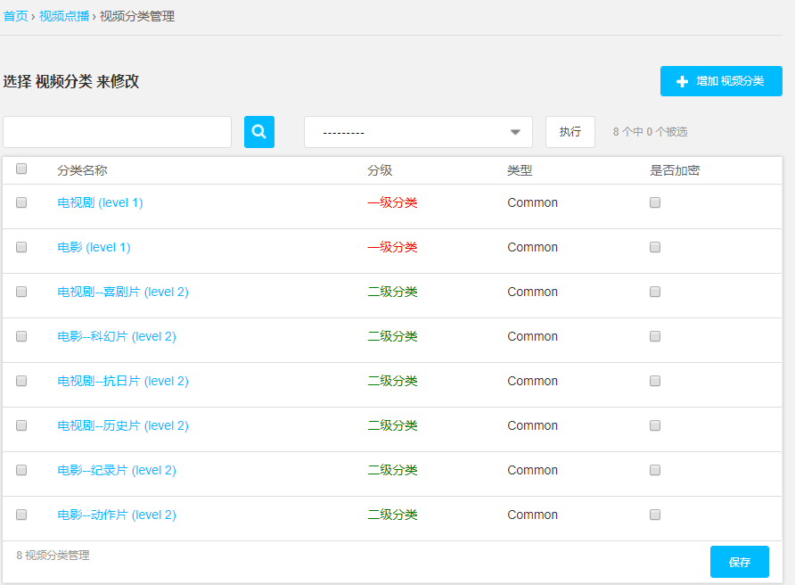

如上图所示，分类的级别和分类关系显示在分类名称字段下。

## 视频上传路径管理

这里用于管理视频上传到服务器中具体的文件夹路径，目前只稳定支持默认路径，为服务器中的`/home/share/vod/media`文件夹，其中`/home/share/vod`为点播应用程序的根路径。

> 未来希望实现的效果为允许将视频文件上传到任意其他路径，比如想上传到`/var/www/media/`目录下，需要在`/home/share/vod/media/`文件夹下面创建一个软连接，链接到`/var/www/media/`目录，然后才可以正确上传到`/var/www/media/`文件夹中。目前该功能仍在测试中。

## 批量上传管理

用于批量上传视频、图片文件，并自动生成对应的点播节目。对于批量上传功能，规定：

- 上传的视频文件格式必须是MP4，且视频编码格式为H.264，音频编码格式为AAC。图片文件格式为`.jpg`或`.png`。如果需要支持其他图片格式，可联系开发人员进行配置。
- 对某一个点播节目来说，这里上传的视频文件和图片文件的文件名必须相同，才能正确生成包含该视频和图片的一个节目，否则会生成两个不同的节目。比如想上传一部电影叫`星球大战`，那么视频文件名称必须为`星球大战.mp4`，图片文件名称必须为`星球大战.jpg`或`星球大战.png`。

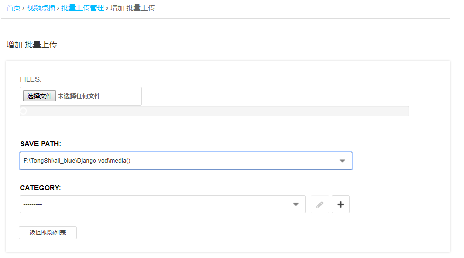

# 视频录制应用管理

视频点播系统包含的另一个功能是将电视直播录制下来的视频转换为点播节目，所以另一个应用为视频录制。这里包含两个数据表的管理：

- 节目管理

  > 所有直播回看服务器中包含的节目数据

- 频道管理

  > 所有直播回看服务器中包含的频道列表数据

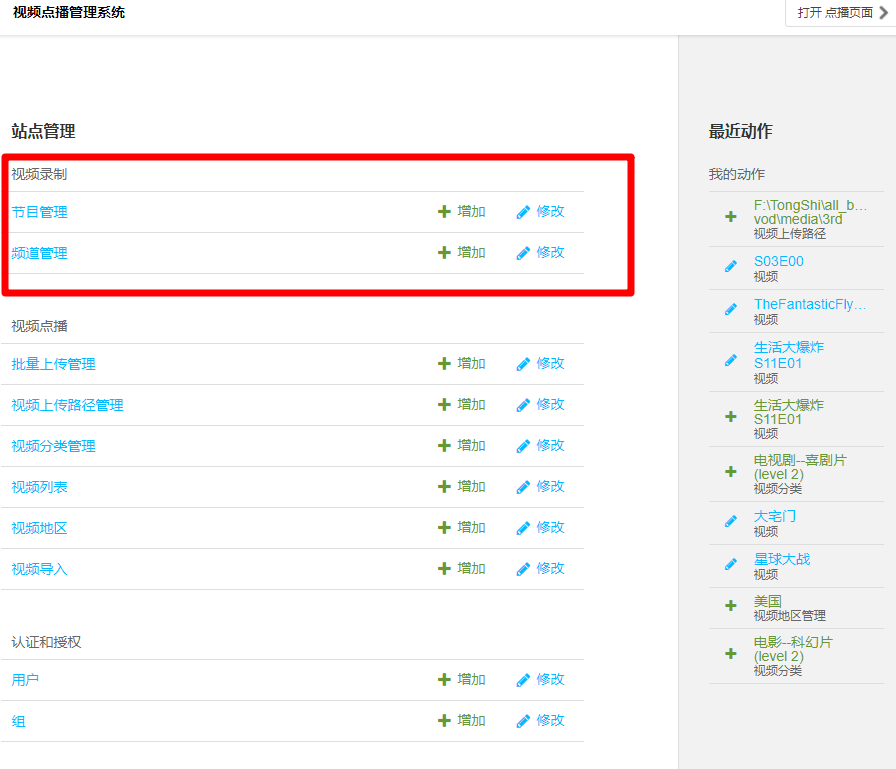

## 节目管理

显示直播回看服务器中数据库存储的节目数据，与视频点播应用中介绍的视频列表界面相似，提供过滤器、搜索、执行动作等功能。该界面可以方便地显示每一条节目地信息。

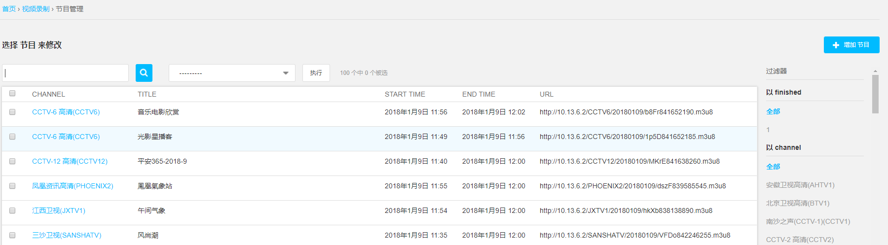

## 频道管理

这里提供直播回看服务器中数据库存储地频道列表数据，也可以对该频道的直播地址等信息进行编辑，但是不建议在这里对频道进行修改操作。需要操作的话请进入电视直播回看管理页面进行编辑。

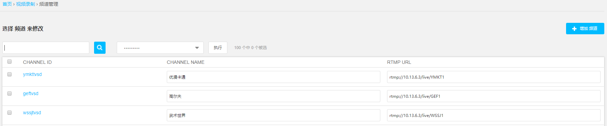

# 常见点播视频管理操作说明

## 添加一个单独的点播节目

一共有两种途径进入创建点播节目页面：

- 在管理员页面进入`视频点播`应用中的`视频列表`页面，然后点击右上角的`增加视频`按钮。
- 直接点击管理员页面中`视频点播`应用中的`视频列表`后面的`增加`按钮。

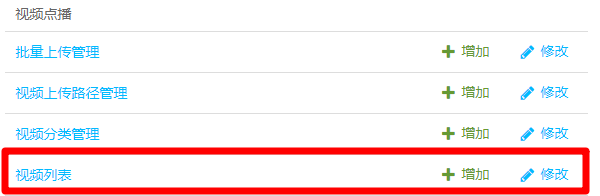

进入创建点播节目页面后，可以编辑的字段如下图所示，由于比较长，分成两个图片显示：

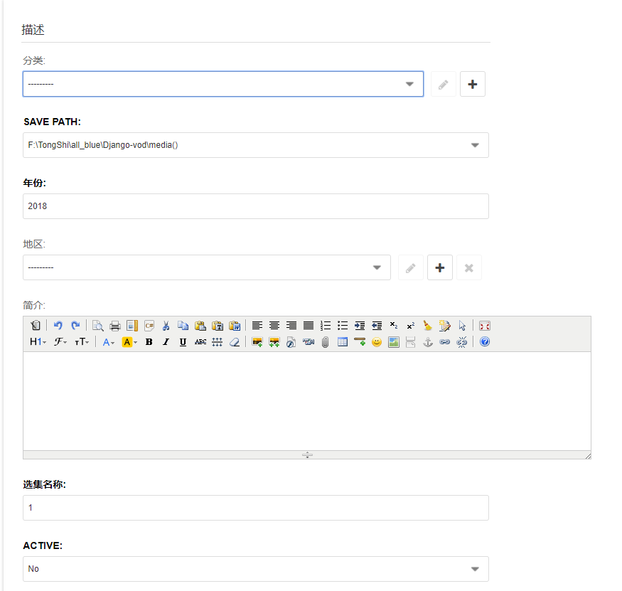

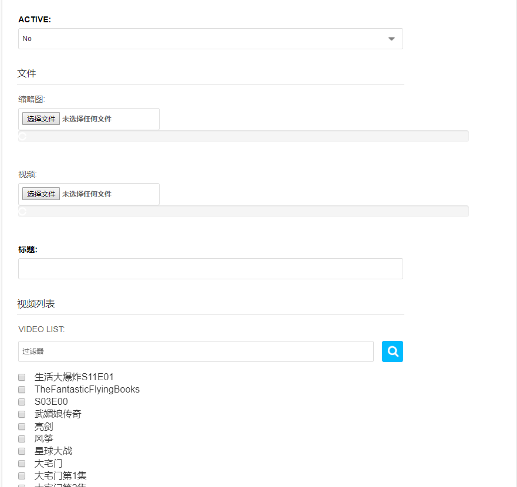

从上到下分别介绍每个字段的含义：

- 分类

  选择在`视频分类管理`中创建的分类信息，可以直接点击网页上的`+`按钮进行快捷创建分类信息。

- 保存路径

  上传文件保存到点播服务器的具体路径，目前不用编辑，使用默认即可。

- 年份

  该视频的年份，写入年份数字即可，如`2018`。默认为当前年份。

- 地区

  选择在`视频地区`中创建的地区信息，可以直接点击网页上的`+`按钮进行快捷创建地区信息。

- 简介

  视频的简介，使用富文本编辑器进行编辑，支持图片、超链接、文字颜色、排版等丰富的文本信息，该字段存储的格式为网页的HTML格式。如果在其他网页中找到了该视频的简介信息，可以直接复制粘贴过来，会保留原有网页的格式信息。

- 选集名称
  对于单独的视频来说，该字段不会展示到点播网页中。如果该视频在后来被其他点播节目当作子视频来播放，那么该字段会显示在点播网页播放页面中的选集按钮上。

  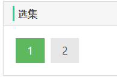

- 激活

  是否将该视频发布到点播网页中，`No`则代表点播网页中不会显示该视频。

- 缩略图文件

  上传该视频的封面图片，图片格式不限，建议使用常见的图片格式`.png` `.jpg` `.jpeg`。

- 视频文件

  上传该视频的视频文件，格式必须为`.mp4`，且视频编码方式为`H.264`，音频编码方式为`AAC`。

> 在选择文件进行音视频文件上传时，首先会提示是否上传该文件，然后会检查点播服务器是否已经包含同名文件，如果包含同名文件，可以选择覆盖掉之前的文件继续上传，或者手动更改文件名重新上传。建议手动更改文件名，保证一致性。

- 标题

  点播节目的标题，上传视频文件时，会自动生成为与视频文件名称相同的标题。

- 视频列表

  用于选择该点播节目下包含的其他子视频，通过点击复选框进行选择，支持拖拽更改子视频列表顺序。对于一个独立的视频节目，不需要进行该字段的修改。

在完成该点播视频的信息编辑后，点击`保存`按钮，即可完成该点播节目的编辑，如果该视频的`激活`字段为`Yes`，那么就会在点播网页中看到该节目。

## 添加一个视频集合（电视剧）
如果想上传一整部电视连续剧，首先通过上面`添加一个单独的点播节目`将每一集的视频创建为一个单独的点播节目，因为每一集的点播节目不需要直接显示在点播网页视频列表中，所以每一集的点播节目不需要编辑所有字段的信息，需要编辑的字段信息有：

- 视频文件
- 选集名称
  > 选集名称即点播播放页面中`选集`按钮中显示的该视频的按钮名称
- 标题
  > 该标题不是必须的，但是不能为空，建议每一集的视频的标题设置为`xxx第x集`，这样可以在点播节目列表页面中清楚地看到。

- 激活
  > 由于每一集的视频是属于某一个电视剧下面的子视频，所以不需要单独显示为一个点播节目，所以该字段需要设置为`No`。

额外的字段：

- 视频列表
  > 该字段用于表明该集视频是属于哪一个电视剧节目的，当电视剧节目并未创建时，可以暂时不编辑该字段。当电视剧节目已经创建完成，可以勾选电视剧节目进行关联。不建议在上传每一集的视频时编辑该字段。

当上传完成每一集视频后，再创建一个包含每一集视频的点播节目，需要编辑的字段信息有：

- 分类
- 年份
- 地区
- 简介
  > 允许为空。

- 是否激活
  > 这里选择`Yes`即可激活该视频，会在点播页面中对应的位置看到。

- 缩略图
  > 允许为空。

- 标题
- 视频列表
  > 勾选之前创建的每一集的视频，并且按照正确的顺序拖拽。在视频列表过滤器中输入关键字，可以快速查找视频。

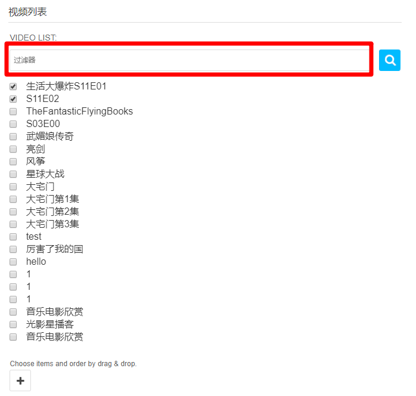

## 创建一个分类

一共有两种途径进入创建点播节目页面：

- 在管理员页面进入`视频点播`应用中的`视频分类管理`页面，然后点击右上角的`增加视频分类`按钮。
- 直接点击管理员页面中`视频点播`应用中的`视频分类管理`后面的`增加`按钮。

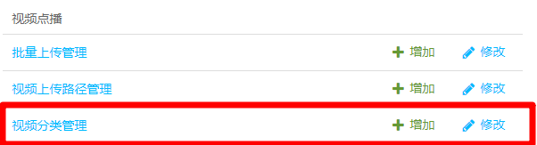

进入创建分类页面：

如果需要创建一级分类，仅需要填写：

- 分类名称
- 分类等级（一级分类）

即可完成一级分类的创建。

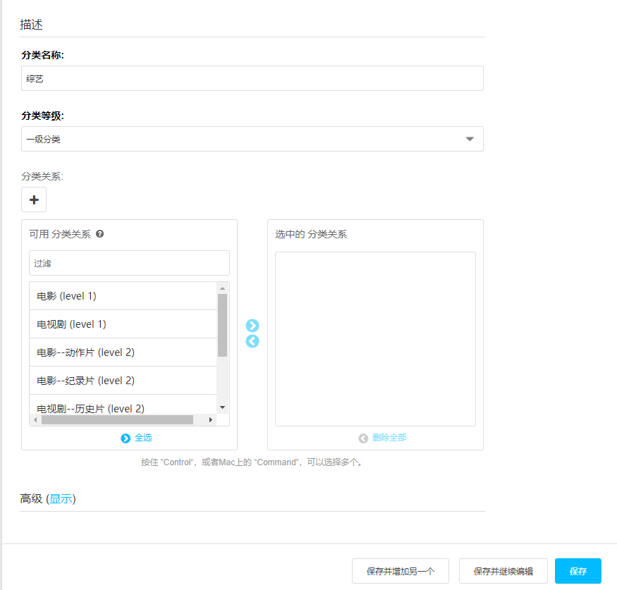

如果需要某个一级分类下的二级分类，需要填写：

- 分类名称
- 分类等级（二级分类）
- 分类关系（所属的一级分类）

在分类关系选择页面中，在左边`可用分类关系`里找到一级分类，然后点击向右的箭头`>`将该一级分类添加到`选中的分类关系`中即可完成与所属一级分类建立联系。

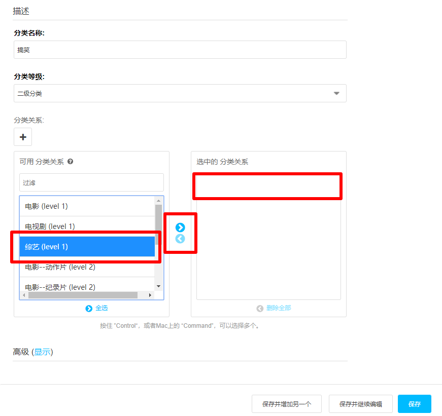

## 批量上传视频文件和封面图片文件

用于批量上传视频、图片文件，并自动生成对应的点播节目。对于批量上传功能，规定：

- 上传的视频文件格式必须是MP4，且视频编码格式为H.264，音频编码格式为AAC。图片文件格式为`.jpg`或`.png`。如果需要支持其他图片格式，可联系开发人员进行配置。
- 对某一个点播节目来说，这里上传的视频文件和图片文件的文件名必须相同，才能正确生成包含该视频和图片的一个节目，否则会生成两个不同的节目。比如想上传一部电影叫`星球大战`，那么视频文件名称必须为`星球大战.mp4`，图片文件名称必须为`星球大战.jpg`或`星球大战.png`。

在选择文件之前，可以选择分类字段，以指定这些文件都属于哪一个分类。不选择则不指定分类，需要在`视频列表`中对每个视频进行分类设定，并且需要手动开启每个点播节目的激活选项。

在选择文件时可以同时选择多个文件，也可以在添加完一次文件后继续选择添加的文件。

## 对视频列表进行批量操作

在`视频列表`中，在需要进行批量操作的点播节目前勾选复选框，然后在`执行动作列表`中选择要进行的操作，最后点击`执行`即可完成对已勾选的点播节目进行对应的操作，目前支持的操作有：

- 删除所选视频（仅在数据库中删除）

- 删除所选视频（同时删除数据库内信息以及视频、图片文件）

- 激活所选视频

- 取消激活所选视频

- 备份所选视频

- 备份所有点播应用数据

  > 这里是备份所有的数据，但是必须随便选择一个视频再执行该操作。备份的所有数据包括地区列表、视频列表、分类信息列表等所有视频点播应用中的数据。

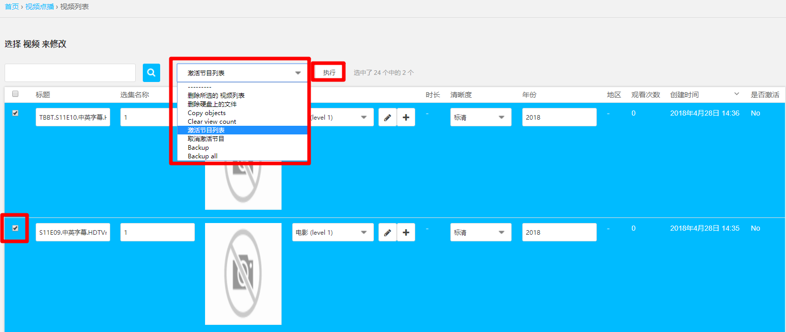

## 点播节目数据备份及恢复

- 备份

在`视频列表`中勾选需要备份的视频数据，然后在`执行动作列表`中选择`备份`，即可在浏览器中下载到生成的备份文件，文件格式为`json`的文本文件。

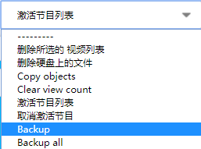

如果需要备份所有点播视频节目及分类、地区等信息，则在勾选至少一个点播节目后，执行`备份所有`，即可在浏览器中下载到生成的备份文件，文件格式为`json`的文本文件。

- 恢复

进入`增加视频导入`页面，一共有两种途径：

1. 在管理员页面进入`视频点播`应用中的`视频导入`页面，然后点击右上角的`增加视频导入`按钮。
2. 直接点击管理员页面中`视频点播`应用中的`视频导入`后面的`增加`按钮。

在`备份配置文件`处添加之前备份好的`json`文本文件，然后点击`保存`，即可又点播服务程序自动根据备份文件生成点播节目数据。

- 警告

由上面这种方式备份、恢复的数据仅仅是数据库内的信息，而不包括图片、视频文件本身，所以在备份恢复数据时，需要考虑手动将点播服务器文件系统中的视频、图片文件进行迁移，迁移时图片、视频文件的路径一定要一一对应。

## 录播节目转点播

在管理页面中的`视频录制`应用中，选择`节目管理`进入录制节目列表页面

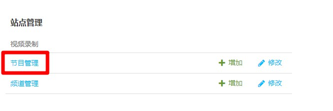

选择需要转换的点播节目，然后在`执行动作列表`中选择`转为点播`，点击`执行`按钮，即可启动录播节目转点播。

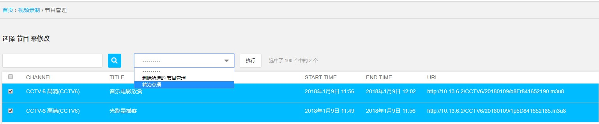

转换过程需要一些时间，在启动录制节目转点播之后，服务器后台会去下载录制节目到点播服务器中，如果下载的地址不合法，或者网络出现问题无法获取到录制节目，会显示错误提示信息。如果出现错误信息，则需要检查网络连接，此时是不会创建点播节目的。
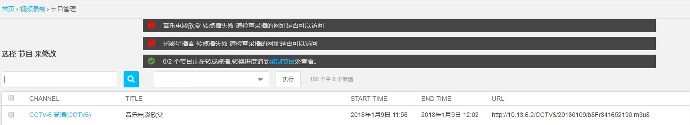

点击其中的蓝色超链接`录制节目`会跳转到`视频列表`页面。当正确完成下载过程后，生成的点播节目的`激活`状态会被自动设为`Yes`，否则代表该录播节目正在下载过程中，请耐心等待。